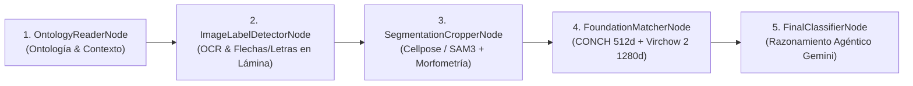

# SAM 3 Histology Annotator, Foundation Models & Roboflow Pipeline 🚀🔬

Plataforma integral de **segmentación celular e histológica de alta precisión**, **modelos fundacionales de patología (CONCH, UNI, Virchow 2)**, **sistema multi-agente con LangGraph y Gemini Vision**, **extracción de ontologías desde PDFs académicos** y **pipeline de exportación y entrenamiento en Roboflow**.

Diseñada para analizar cortes histológicos y micrografías complejas con cientos o miles de células y estructuras por imagen. Permite segmentar automáticamente en segundos con aceleración por GPU, clasificar biológicamente mediante modelos de fundación, curar/corregir anotaciones individualmente y exportar o entrenar modelos de visión artificial para investigación biomédica y patología computacional.

---

## 🌟 Tabla de Contenidos
1. [Características Principales](#-características-principales)
   - [1. Motores de Segmentación Duales en GPU](#-1-motores-de-segmentación-duales-en-gpu)
   - [2. Modelos Fundacionales de Patología](#-2-modelos-fundacionales-de-patología-digital)
   - [3. Pipeline Multi-Agente con LangGraph y Gemini Vision](#-3-pipeline-multi-agente-con-langgraph-y-gemini-vision)
   - [4. Extracción de PDFs, Ontologías Asistidas por IA y Atlas](#-4-extracción-de-pdfs-ontologías-asistidas-por-ia-y-atlas)
   - [5. Suite de Anotación y Visor Web Reactivo](#-5-suite-de-anotación-y-visor-web-reactivo)
   - [6. Exportación e Integración con Roboflow](#-6-exportación-e-integración-con-roboflow)
2. [Estructura del Proyecto](#️-estructura-del-proyecto)
3. [Rutas de la API (Endpoints Backend)](#-rutas-de-la-api-endpoints-backend)
4. [Arquitectura y Rendimiento](#-arquitectura-y-rendimiento)
5. [Requisitos Previos](#-requisitos-previos)
6. [Instalación y Configuración](#️-instalación-y-configuración)
7. [Puesta en Marcha](#-puesta-en-marcha)
8. [Flujo de Trabajo Paso a Paso](#-flujo-de-trabajo-paso-a-paso)
9. [Licencias y Agradecimientos](#️-licencias-y-agradecimientos)

---

## 🌟 Características Principales

### 🧠 1. Motores de Segmentación Duales en GPU

* **Meta SAM 3.1 (Segment Anything Model 3.1)**:
  * Segmentación *zero-shot* guiada por lenguaje natural (*open-vocabulary*).
  * Arquitectura híbrida: inferencia de ultra-alta velocidad mediante `SAM3SemanticPredictor` (Ultralytics) con conmutación por error transparente a `Sam3Processor` nativo de Meta.
  * **Click-to-Segment (`/api/segment-point`)**: Segmentación instantánea de estructuras celulares haciendo click sobre el punto de interés.
  * **Multi-Prompt Automático (`/api/segment-auto`)**: Detección masiva paralela usando batería de conceptos histológicos (*"cell nucleus"*, *"circular lumen"*, *"elongated fiber"*, etc.).
  * **Aislamiento por hilo (`sam3_inference_context`)**: Ejecución thread-safe en precisión mixta `bfloat16` con `torch.inference_mode()` para prevenir discrepancias de tipo de dato (*dtype mismatches*).

* **Cellpose & Cellpose-SAM (`cpsam`, `cpsam_v2`, `nuclei`, `cyto3`, `tissuenet`)**:
  * Motor especializado en microscopía de fluorescencia y cortes densos teñidos con Hematoxilina & Eosina (H&E).
  * Estimación automática o manual del diámetro celular para optimizar la escala de detección.
  * Extracción de máscaras y polígonos celulares de alta densidad con separación de bordes contiguos.

* **Gestor Dinámico de Memoria VRAM (`prepare_engine_vram`)**:
  * Intercambio inteligente (*swapping*) entre GPU y CPU al alternar entre SAM 3 y Cellpose.
  * Limpieza activa de fragmentación con `torch.cuda.empty_cache()`, permitiendo ejecutar modelos de miles de millones de parámetros en GPUs de consumo (ej. NVIDIA RTX 3050 / 3060) sin errores de *CUDA Out of Memory*.

---

### 🧬 2. Modelos Fundacionales de Patología Digital

* **CONCH (Mahmood Lab - Harvard/BWH)**:
  * Modelo Vision-Language pre-entrenado en más de **1.17 millones de pares imagen-texto** histológicos.
  * Proyección en espacio latente de **512 dimensiones** para clasificación *zero-shot* y cálculo de similitud texto-morfología celular.
* **UNI (Mahmood Lab)**:
  * Extractor de representaciones morfológicas densas de **1024 dimensiones** basado en ViT-Large pre-entrenado en más de **100 millones de parches tisulares**.
* **Virchow 2 (Paige AI)**:
  * Modelo de patología computacional de escala masiva (ViT-Huge, **1280 dimensiones**) entrenado sobre **3.1 millones de láminas histológicas completas** (*WSI*).
  * Clasificación morfológica y clustering de prototipos celulares por distancia coseno para identificar subtipos y patrones atípicos.
* **Status y Precarga en Tiempo Real (`/api/pathology-models-status`, `/api/preload-model`)**:
  * Indicadores visuales en el header que muestran el estado de carga en VRAM de cada modelo con posibilidad de precarga manual con un click.

---

### 🤖 3. Pipeline Multi-Agente con LangGraph y Gemini Vision

Flujo orquestado mediante un grafo agéntico de 5 nodos para máxima exactitud taxonómica en láminas complejas:



1. **`OntologyReaderNode`**: Carga la ontología tisular activa y filtra las clases biológicas plausibles para el órgano analizado.
2. **`ImageLabelDetectorNode` (Visual Grounding & OCR con Gemini Vision)**: Detecta marcas visuales impresas en la lámina (flechas, cabezas de flecha, letras guía como *A, B, S, L* o asteriscos) y las vincula con la leyenda del documento.
3. **`SegmentationCropperNode`**: Extrae recortes de alta resolución de cada detección y calcula métricas morfométricas determinísticas (área, circularidad, excentricidad, relación núcleo-citoplasma y densidad óptica).
4. **`FoundationMatcherNode`**: Computa similitudes texto-imagen (CONCH) y similitudes morfológicas profundas (Virchow 2).
5. **`FinalClassifierNode`**: Árbitro agéntico multimodal que sintetiza morfometría, proximidad espacial a flechas/etiquetas y puntajes de los modelos fundacionales, emitiendo la clasificación final con una traza de razonamiento explicativa.

---

### 📄 4. Extracción de PDFs, Ontologías Asistidas por IA y Atlas

* **Extracción de Contenido con PyMuPDF**:
  * Procesa libros y papers académicos en PDF extrayendo el texto completo y todas las figuras y micrografías incrustadas.
  * **Renderizado de respaldo automático (150 DPI)**: Si el PDF contiene figuras vectoriales o compuestas, renderiza vistas completas de alta resolución para que ninguna lámina quede excluida.
* **Ingeniería de Ontologías con Gemini IA**:
  * Diseña jerarquías biológicas canónicas en español y en inglés con descripciones y *prompts visuales optimizados* para el vocabulario de SAM 3.
  * **Sistema de resiliencia**: Extracción multimodal (visión de micrografías + texto) con reintento automático en texto plano mediante `gemini-2.5-flash` para garantizar la generación consistente de la ontología.
  * **Aislamiento de dominios**: Cada documento crea su propia ontología temática con soporte para fusión incremental opcional (*merge*).
* **Gestor CRUD de Imágenes de Atlas**:
  * Galería interactiva con visor modal y zoom de alta resolución.
  * Edición y persistencia de pies de figura (*captions*).
  * Adición de imágenes externas y eliminación de diagramas irrelevantes.
  * **Segmentación en lote (*Batch Segment*)**: Procesa y segmenta automáticamente todas las láminas del PDF con un solo click.

---

### ✂️ 5. Suite de Anotación y Visor Web Reactivo

* **Renderizado Vectorial SVG de Alto Rendimiento**:
  * Simplificación de contornos poligonales con algoritmo **Ramer-Douglas-Peucker (`approxPolyDP`)**, transformando miles de píxeles densos en polígonos vectoriales livianos (10–30 vértices).
* **Herramientas de Selección y Edición**:
  * Selección individual, múltiple con `Shift + Click`, o masiva con `Ctrl + A`.
  * Reasignación rápida de categorías biológicas mediante menú contextual (click derecho) o panel de clases.
  * Eliminación de anotaciones con las teclas `Delete` o `Backspace`.
* **Filtrado Reactivo por Confianza**:
  * Slider reactivo en cliente que filtra detecciones en memoria \(O(N)\) en tiempo real sin requerir re-ejecución en la GPU.
* **Gestor Dinámico de Clases**:
  * Modificación de nombres, paleta de colores RGB/HEX (*Color Picker*) y ocultamiento/visibilidad por categoría.

---

### 🚀 6. Exportación e Integración con Roboflow

* **Exportación COCO JSON**:
  * Descarga directa del dataset en formato estándar COCO (`images`, `categories`, `annotations` con bounding boxes y polígonos `segmentation`).
* **Subida Directa a Roboflow**:
  * Envío de imágenes y dataset anotado directamente a tu Workspace y Proyecto de Roboflow mediante API REST multipart.
* **Disparo de Entrenamiento Remoto**:
  * Lanza el entrenamiento de modelos de visión artificial (ej. YOLOv8, YOLOv11) en la nube de Roboflow desde la interfaz.

---

## 🏗️ Estructura del Proyecto

```text
Meta_SAM_V3/
├── backend/
│   ├── main.py                     # API FastAPI: Endpoints de inferencia, modelos y Roboflow
│   ├── cellpose_segmenter.py       # Motor Cellpose & Cellpose-SAM con gestión dinámica de GPU
│   ├── histology_graph.py          # Grafo multi-agente LangGraph (5 nodos de razonamiento)
│   ├── pathology_models.py         # Modelos fundacionales: CONCH (512d), UNI (1024d) y Virchow 2 (1280d)
│   ├── gemini_vision.py            # Asistente multimodal, OCR y refinamiento con Gemini Vision
│   ├── pdf_ontology.py             # Extracción de PDFs, ontologías jerárquicas y CRUD de imágenes
│   └── roboflow_integration.py     # Exportación COCO JSON, upload multipart y training en Roboflow
├── frontend/
│   ├── src/
│   │   └── pages/
│   │       └── index.astro         # Aplicación web reactiva moderna (Astro + Vanilla JS + CSS)
│   ├── package.json
│   └── astro.config.mjs
├── sam3/                           # Submódulo / Repositorio local de Meta SAM 3.1
├── datasets/
│   ├── ontologies/                 # Ontologías temáticas guardadas en formato JSON
│   └── pdf_images/                 # Imágenes y textos extraídos organizados por PDF ID
├── segmenter.py                    # Script CLI para segmentación interactiva por terminal
├── sam3.pt                         # Checkpoint de pesos de SAM 3
├── pyproject.toml                  # Configuración de dependencias Python (uv / hatchling)
├── start.sh                        # Script de inicio concurrente del backend y frontend
└── package.json                    # Script principal de ejecución (npm run dev)
```

---

## 📡 Rutas de la API (Endpoints Backend)

### 🔬 Segmentación
| Método | Endpoint | Descripción |
| :--- | :--- | :--- |
| `POST` | `/api/segment` | Segmentación zero-shot con SAM 3 basada en texto o caja delimitadora. |
| `POST` | `/api/segment-auto` | Segmentación automática multi-concepto (núcleos, lúmenes, fibras). |
| `POST` | `/api/segment-point` | Segmentación interactiva por coordenadas de click (*Click-to-Segment*). |
| `POST` | `/api/segment-cellpose` | Segmentación celular especializada con Cellpose / Cellpose-SAM. |

### 🧬 Modelos Fundacionales & LangGraph
| Método | Endpoint | Descripción |
| :--- | :--- | :--- |
| `GET` | `/api/pathology-models-status` | Estado de carga en VRAM y dimensiones de CONCH, UNI y Virchow 2. |
| `POST` | `/api/preload-model` | Precarga manual de un modelo de fundación en VRAM. |
| `POST` | `/api/classify-conch` | Clasificación zero-shot de recortes celulares con CONCH (512d). |
| `POST` | `/api/extract-virchow-features` | Extracción de embeddings y clustering con Virchow 2 (1280d). |
| `POST` | `/api/gemini-multimodal-classify` | Clasificación visual multimodal con Gemini Vision. |
| `POST` | `/api/langgraph-classify` | Ejecución del pipeline de 5 agentes con LangGraph. |

### 📄 PDFs & Ontología
| Método | Endpoint | Descripción |
| :--- | :--- | :--- |
| `POST` | `/api/upload-pdf` | Extracción de texto e imágenes (embebidas y renders) desde un PDF. |
| `POST` | `/api/generate-ontology` | Generación de ontología temática jerárquica con Gemini IA. |
| `GET` | `/api/ontologies` | Listado de todas las ontologías persistidas en `datasets/ontologies/`. |
| `GET` | `/api/ontology/{name}` | Obtención del documento JSON de una ontología específica. |
| `PUT` | `/api/ontology/{name}` | Actualización y edición de estructuras de una ontología. |
| `GET` | `/api/pdf-images/{pdf_id}` | Listado de imágenes extraídas asociadas a un PDF. |
| `GET` | `/api/pdf-image/{pdf_id}/{filename}` | Servidor de archivos de imágenes extraídas del PDF. |
| `POST` | `/api/pdf-images/{pdf_id}/add` | Carga de una imagen adicional al dataset del PDF. |
| `DELETE` | `/api/pdf-images/{pdf_id}/{filename}` | Eliminación de una imagen del dataset del PDF. |
| `PUT` | `/api/pdf-images/{pdf_id}/{filename}/caption` | Actualización del pie de figura (*caption*) de una imagen. |
| `POST` | `/api/batch-segment-pdf` | Segmentación en lote de todas las imágenes del PDF. |

### 🚀 Roboflow & Exportación
| Método | Endpoint | Descripción |
| :--- | :--- | :--- |
| `POST` | `/api/export-coco` | Conversión y descarga del dataset en formato COCO JSON estándar. |
| `GET` | `/api/roboflow-status` | Verificación de conexión con el workspace y proyecto en Roboflow. |
| `POST` | `/api/upload-roboflow` | Subida multipart de imágenes y anotaciones a Roboflow. |
| `POST` | `/api/train-roboflow` | Disparo de entrenamiento de modelos de visión en Roboflow. |

---

## 📐 Arquitectura y Rendimiento

### ⏱️ Complejidad Temporal (Time Complexity)
1. **Caché de Embeddings Visuales en SAM 3 (\(O(1)\) para prompts secundarios)**:
   * El Vision Transformer (ViT) procesa la imagen una sola vez (`processor.set_image`).
   * Los prompts de texto o puntos subsiguientes reutilizan el mapa de características visuales en memoria, reduciendo el costo de inferencia de \(O(\text{ViT Backbone Forward})\) a \(O(\text{Cross-Attention})\).
2. **Simplificación Poligonal Ramer-Douglas-Peucker (\(O(P_{\text{denso}}) \to O(P_{\text{aprox}})\))**:
   * Algoritmo `cv2.approxPolyDP` (`epsilon=1.5`) reduce contornos de miles de píxeles a polígonos vectoriales livianos (10–30 vértices), acelerando el renderizado SVG en el navegador y reduciendo el tamaño del payload JSON.
3. **Filtrado Reactivo en Cliente (\(O(N)\))**:
   * El slider de umbral filtra las \(N\) detecciones directamente en memoria en JavaScript en \(O(N)\), eliminando llamadas de red y re-inferencias innecesarias en PyTorch.

### 💾 Complejidad Espacial y Gestión de Memoria GPU (Space Complexity)
1. **Dynamic VRAM Swapping**:
   * Descarga selectiva de tensores a CPU (`.to("cpu")`) y limpieza de fragmentación con `torch.cuda.empty_cache()` al alternar entre SAM 3 y Cellpose-SAM.
2. **Inferencia en Precisión Mixta (`bfloat16` + `torch.inference_mode()`)**:
   * Reduce el consumo de VRAM en un 50% frente a Float32.
   * `torch.inference_mode()` deshabilita el grafo de autograd, fijando la memoria retenida en \(O(1)\).
3. **Escalado Acotado (`MAX_INFERENCE_DIM = 1440`)**:
   * Previene desbordamientos de memoria en imágenes gigapíxel escalando proporcionalmente antes de la inferencia y reescalando las coordenadas de salida sin pérdida de precisión.

---

## 🛠️ Requisitos Previos

1. **Sistema Operativo**: Linux (Ubuntu 20.04+, Debian, Arch, Fedora) o Windows con WSL2.
2. **GPU NVIDIA**: Tarjeta gráfica compatible con CUDA (RTX 3050, 3060, 4060 o superior recomendada).
3. **Python**: Versión `>= 3.10` (recomendado Python 3.12).
4. **Node.js**: Versión `>= 18.0.0`.
5. **Administrador de paquetes uv**: [uv de Astral](https://github.com/astral-sh/uv) para resolución ultra-rápida de dependencias Python.
6. **Credenciales de API**:
   * **Google Gemini API Key**: Para extracción de ontologías y razonamiento agéntico en LangGraph.
   * **Hugging Face Token**: Para descargar checkpoints de SAM 3.1, CONCH, UNI y Virchow 2.
   * **Roboflow API Key** *(opcional)*: Para exportación y entrenamiento remoto.

---

## ⚙️ Instalación y Configuración

### 1. Variables de Entorno
Copia la plantilla `.env.example` a `.env` y completa tus credenciales:

```env
# Gemini API Key para Ontologías y LangGraph
GEMINI_API_KEY=AIzaSy...

# Hugging Face Token para SAM 3.1 y Modelos Fundacionales
HF_TOKEN=hf_...

# Roboflow (Opcional)
ROBOFLOW_API_KEY=tu_api_key_privada
ROBOFLOW_WORKSPACE=nombre_de_tu_workspace
ROBOFLOW_PROJECT=nombre_de_tu_proyecto
```

### 2. Instalación de Dependencias con uv
```bash
# Sincronizar el entorno virtual de Python con todas las dependencias
uv sync
```

### 3. Dependencias de Node.js (Frontend)
```bash
cd frontend
npm install
cd ..
```

---

## 🚀 Puesta en Marcha

Para iniciar el Backend (FastAPI en puerto `8000`) y el Frontend (Astro en puerto `4321`) simultáneamente con un solo comando:

```bash
npm run dev
```

o mediante el script de arranque directo:

```bash
./start.sh
```

### URLs de Acceso:
* 🌐 **Frontend Web**: [http://localhost:4321](http://localhost:4321)
* 📡 **API Backend & Swagger Docs**: [http://localhost:8000/docs](http://localhost:8000/docs)

---

## 💻 Flujo de Trabajo Paso a Paso

1. **Subida de Imágenes o PDFs**:
   * En la pestaña **`🖼️ Imágenes`**, sube micrografías locales mediante arrastrar y soltar.
   * En la pestaña **`📄 PDFs & Ontología`**, sube un paper o libro en PDF para extraer automáticamente figuras, texto y generar la ontología biológica con Gemini IA.
2. **Selección de Motor de Segmentación**:
   * Elige **Meta SAM 3.1** para segmentación guiada por texto o click interactivo.
   * Elige **Cellpose-SAM** (`cpsam`) para cortes celulares densos.
3. **Segmentación**:
   * Haz click en **`⚡ Segmentar Elementos`**, **`⚡ Auto-Segmentar`** o activa **`🖱️ Modo Click`** para segmentar estructuras individuales haciendo click sobre ellas.
4. **Refinamiento Multi-Agente con LangGraph**:
   * Pulsa **`⚡ Multi-Agente LangGraph`** para que el pipeline de 5 nodos analice las marcas de la lámina, calcule la morfometría y clasifique los recortes con **CONCH (512d)** y **Virchow 2 (1280d)**.
5. **Curación y Edición Manual**:
   * Selecciona detecciones (`Shift + Click` o `Ctrl + A`).
   * Reasigna categorías con click derecho o el panel de clases.
   * Elimina falsos positivos con `Delete` o `Backspace`.
6. **Exportación y Entrenamiento**:
   * Descarga el dataset en formato **COCO JSON**.
   * O súbelo directamente a **Roboflow** para entrenar tus modelos YOLOv8 / YOLOv11 en la nube.

---

## 🛡️ Licencias y Agradecimientos

* **Meta SAM 3.1**: Desarrollado por Meta AI Research.
* **Cellpose / Cellpose-SAM**: Desarrollado por Carsen Stringer, Marius Pachitariu et al.
* **CONCH & UNI**: Mahmood Lab (Harvard Medical School / Brigham and Women's Hospital).
* **Virchow 2**: Paige AI.
* **LangGraph & Gemini**: LangChain & Google DeepMind.
* **Roboflow**: Roboflow Inc.
