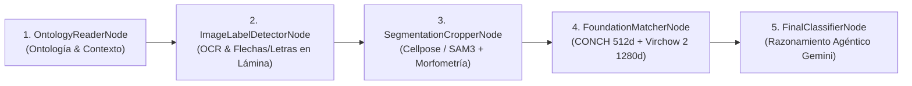

# SAM 3 Histology Annotator, Foundation Models & Roboflow Pipeline 🚀🔬

Plataforma integral de **segmentación celular e histológica de precisión**, **modelos fundacionales de patología (CONCH, UNI, Virchow 2)**, **sistema multi-agente con LangGraph y Gemini Vision**, **extracción de ontologías de PDFs** y **pipeline de entrenamiento en Roboflow**.

Diseñada especialmente para imágenes microscópicas complejas y cortes histológicos que contienen cientos o miles de células y estructuras por imagen. Permite segmentar automáticamente en segundos con aceleración por GPU, clasificar biológicamente mediante modelos de fundación, curar/corregir anotaciones individualmente y exportar o entrenar modelos de visión artificial.

---

## 🌟 Características Principales

### 🧠 1. Motores de Segmentación Duales en GPU
* **Meta SAM 3.1 (Segment Anything Model 3.1)**:
  * Segmentación zero-shot guiada por texto (*open-vocabulary*).
  * Soporte para inferencia de ultra-alta velocidad mediante `SAM3SemanticPredictor` (Ultralytics) y `Sam3Processor` nativo.
  * Suite *multi-prompt* automática (*"cell nucleus"*, *"circular lumen"*, *"elongated fiber"*, etc.).
* **Cellpose & Cellpose-SAM (`cpsam`, `cpsam_v2`)**:
  * Motor especializado en microscopía y cortes histológicos densos.
  * Extracción precisa de bordes y morfologías nucleares/celulares complejas.
  * Estimación automática o manual del diámetro celular.
* **Gestor Dinámico de Memoria VRAM (`prepare_engine_vram`)**:
  * Intercambio (*swapping*) inteligente de modelos entre GPU y CPU en tiempo de ejecución.
  * Garantiza el 100% de la VRAM disponible para el motor activo en tarjetas gráficas de consumo (ej. NVIDIA RTX 3060 / 3050) sin errores de *CUDA Out Of Memory (OOM)*.

---

### 🧬 2. Modelos Fundacionales de Patología Digital
* **CONCH (Mahmood Lab - Harvard/BWH)**:
  * Modelo Vision-Language pre-entrenado en más de 1.17 millones de pares imagen-texto histológicos.
  * Clasificación zero-shot de recortes celulares (*crops*) en espacios de incrustación de 512 dimensiones.
* **UNI (Mahmood Lab)**:
  * Extractor de representaciones morfológicas densas de 1024 dimensiones basado en ViT-Large pre-entrenado en 100M+ parches histológicos.
* **Virchow 2 (Paige AI)**:
  * Modelo de fundación de patología computacional de escala masiva (ViT-Huge, 1280 dimensiones) pre-entrenado en más de 3.1 millones de láminas completas (*Whole Slide Images*).
* **Discriminación y Clustering Semántico**:
  * Agrupación automática de células por afinidad morfológica y distancia coseno para descubrir subtipos celulares no etiquetados previamente.

---

### 🤖 3. Pipeline Multi-Agente con LangGraph y Gemini Vision
Flujo orquestado mediante un grafo agéntico de 5 nodos para maximizar la exactitud taxonómica en láminas histológicas complejas:



1. **`OntologyReaderNode`**: Carga la ontología tisular activa y filtra las clases biológicas plausibles para el órgano en análisis.
2. **`ImageLabelDetectorNode` (Grounding Visual & OCR con Gemini Vision)**: Detecta marcas visuales impresas en la lámina (flechas, cabezas de flecha, letras guía como *A, B, S, L* o asteriscos) y las vincula con la leyenda del paper.
3. **`SegmentationCropperNode`**: Extrae los recortes de alta resolución y calcula métricas morfométricas determinísticas (área, circularidad, excentricidad, relación núcleo-citoplasma y densidad óptica).
4. **`FoundationMatcherNode`**: Computa similitudes texto-imagen (CONCH) y similitudes morfológicas profundas (Virchow 2).
5. **`FinalClassifierNode`**: Un árbitro agéntico multimodal resuelve ambigüedades sintetizando la morfometría, las proximidades espaciales a flechas/etiquetas y los scores de los modelos fundacionales, registrando una traza de razonamiento detallada.

---

### 📄 4. Extracción de Ontologías y CRUD de Imágenes desde PDFs
* **Extracción de Contenido**: Procesa libros o papers en PDF mediante `PyMuPDF` (`fitz`), extrayendo el texto completo y todas las imágenes y figuras embebidas con alta fidelidad.
* **Generación de Ontologías Asistida por LLM (Gemini 2.5 / 3.1)**:
  * Diseña jerarquías biológicas con nombres canónicos, descripciones clínicas y prompts visuales optimizados para segmentación.
* **Gestor CRUD de Imágenes de Atlas**:
  * Visualización en galería y Lightbox con zoom de alta resolución.
  * Edición y persistencia de *captions* y pies de figura.
  * Filtrado, eliminación de diagramas no histológicos y carga de imágenes adicionales.
  * **Segmentación en lote**: Procesamiento automático en batch de todas las láminas del PDF con un solo click.

---

### ✂️ 5. Suite de Anotación y Edición Fina en Visor Web
* **Segmentación Interactiva**:
  * **Click-to-Segment**: Segmentación instantánea por punto (`/api/segment-point`).
  * **Box-Prompting**: Delimitación de regiones con bounding boxes.
* **Selección y Edición de Detecciones**:
  * Selección individual, múltiple con `Shift + Click`, o selección completa con `Ctrl + A`.
  * Reasignación de clases mediante menú contextual (click derecho) o barra de herramientas superior.
  * Eliminación rápida con `Delete` o `Backspace`.
* **Ajuste de Umbral en Tiempo Real**:
  * Slider reactivo para filtrar confianza de detección al instante sin re-ejecutar el pase *forward* en la GPU.
* **Gestión de Clases**:
  * Renombrado *inline*, selector de color (*Color Picker*) y *toggle* de visibilidad por clase.

---

### 🚀 6. Exportación e Integración con Roboflow
* **Exportación Local COCO JSON**: Descarga directa de archivos de anotación estándar (`images`, `categories`, `annotations` con cajas y polígonos `segmentation`).
* **Subida Directa a Roboflow**: Envío de imágenes y dataset consolidado a tu Workspace y Proyecto en Roboflow mediante API REST multipart.
* **Disparo de Entrenamiento Remoto**: Lanza el entrenamiento de modelos de detección y segmentación (ej. YOLOv8 / YOLOv11) en Roboflow con un solo click.

---

## 🏗️ Estructura del Proyecto

```text
Meta_SAM_V3/
├── backend/
│   ├── main.py                     # API FastAPI: Inferencia SAM 3, Cellpose, LangGraph y Roboflow
│   ├── cellpose_segmenter.py       # Módulo Cellpose / Cellpose-SAM con gestión dinámica de GPU
│   ├── histology_graph.py          # Grafo multi-agente LangGraph (5 nodos de razonamiento histológico)
│   ├── pathology_models.py         # Modelos fundacionales: CONCH (512d), UNI (1024d) y Virchow 2 (1280d)
│   ├── gemini_vision.py            # Asistente multimodal, OCR y refinamiento de prompts con Gemini Vision
│   ├── pdf_ontology.py             # Extracción de PDFs, ontologías jerárquicas y CRUD de imágenes
│   ├── roboflow_integration.py     # Conversión a COCO JSON, upload multipart y training en Roboflow
│   ├── test_cellpose.py            # Tests unitarios de Cellpose y VRAM Swapping
│   ├── test_histology_graph.py     # Tests unitarios del grafo LangGraph
│   ├── test_histology_guard.py     # Tests de restricción de dominio y seguridad
│   ├── test_pathology_models.py    # Tests unitarios de CONCH, UNI y Virchow
│   └── test_pdf_ontology.py        # Tests unitarios del pipeline de PDFs
├── frontend/
│   ├── src/
│   │   └── pages/
│   │       └── index.astro         # Interfaz web reactiva moderna (Astro + Vanilla JS + CSS)
│   ├── package.json
│   └── astro.config.mjs
├── sam3/                           # Submódulo / Repositorio local de Meta SAM 3.1
├── datasets/
│   ├── ontologies/                 # Almacenamiento JSON de ontologías persistidas
│   └── pdf_images/                 # Imágenes y textos extraídos organizados por PDF ID
├── segmenter.py                    # Script CLI para segmentación zero-shot interactiva por terminal
├── sam3.pt                         # Checkpoint de pesos de SAM 3 (Hugging Face)
├── pyproject.toml                  # Configuración de dependencias Python (uv / hatchling)
├── start.sh                        # Script de inicialización y verificación del backend y frontend
└── package.json                    # Script principal de ejecución (npm run dev)
```

---

## 📐 Arquitectura y Optimizaciones de Rendimiento

### ⏱️ Complejidad Temporal (Time Complexity)
1. **Caché de Embeddings Visuales en SAM 3 (\(O(1)\) para prompts secundarios)**:
   * El Vision Transformer (ViT) procesa la imagen una sola vez (`processor.set_image`).
   * Los prompts subsiguientes reutilizan el mapa de características visuales en memoria, reduciendo el costo de inferencia adicional de \(O(\text{ViT Backbone Forward})\) a \(O(\text{Cross-Attention})\).
2. **Simplificación Poligonal Ramer-Douglas-Peucker (\(O(P_{\text{denso}}) \to O(P_{\text{aprox}})\))**:
   * Algoritmo `cv2.approxPolyDP` (`epsilon=1.5`) reduce contornos de miles de píxeles a polígonos vectoriales livianos (10-30 vértices), acelerando el renderizado SVG y reduciendo el tamaño del payload JSON.
3. **Filtrado Reactivo en Cliente (\(O(N)\))**:
   * El slider de umbral filtra las \(N\) detecciones directamente en memoria en JavaScript en \(O(N)\), eliminando roundtrips de red y re-inferencias innecesarias en PyTorch.

### 💾 Complejidad Espacial y Gestión de Memoria GPU (Space Complexity)
1. **Dynamic VRAM Swapping**:
   * Descarga selectiva de tensores a CPU (`.to("cpu")`) y limpieza de fragmentación con `torch.cuda.empty_cache()` al alternar entre SAM 3 y Cellpose-SAM.
2. **Inferencia en Precisión Mixta (`bfloat16` + `torch.inference_mode()`)**:
   * Reduce el consumo de VRAM en un 50% frente a FP32.
   * `torch.inference_mode()` deshabilita el grafo de autograd, fijando la memoria retenida en \(O(1)\).
3. **Escalado Acotado (`MAX_INFERENCE_DIM = 1440`)**:
   * Previene desbordamientos de memoria en imágenes gigapíxel escalando proporcionalmente antes de la inferencia y reescalando las coordenadas de salida sin pérdida de precisión.

---

## 🛠️ Requisitos Previos

1. **Sistema Operativo**: Linux (Ubuntu 20.04+, Debian, Arch, Fedora) o Windows con WSL2.
2. **GPU NVIDIA**: Tarjeta gráfica compatible con CUDA (RTX 3050, 3060, 4060 o superior recomendada).
3. **Python**: Versión `>= 3.10` (recomendado Python 3.12).
4. **Node.js**: Versión `>= 18.0.0`.
5. **Administrador de paquetes uv**: [uv de Astral](https://github.com/astral-sh/uv) para resolución ultra-rápida de dependencias.
6. **Credenciales de API**:
   * **Google Gemini API Key**: Para extracción de ontologías y razonamiento en LangGraph.
   * **Hugging Face Token**: Para descargar checkpoints de SAM 3.1, CONCH y Virchow 2.
   * **Roboflow API Key** *(opcional)*: Para exportación y entrenamiento remoto.

---

## ⚙️ Configuración e Instalación

### 1. Variables de Entorno
Copia la plantilla `.env.example` a `.env` y completa tus credenciales:

```env
# Gemini API Key para Ontologías y LangGraph
GEMINI_API_KEY=AIzaSy...

# Hugging Face Token para SAM 3.1 y Modelos Fundacionales
HF_TOKEN=hf_...

# Roboflow (Opcional)
ROBOFLOW_API_KEY=tu_api_key_privada
ROBOFLOW_WORKSPACE=nombre_de_tu_workspace
ROBOFLOW_PROJECT=nombre_de_tu_proyecto
```

### 2. Instalación de Dependencias con uv
```bash
# Sincronizar el entorno virtual con todas las dependencias
uv sync
```

### 3. Dependencias de Node.js (Frontend)
```bash
cd frontend
npm install
cd ..
```

---

## 🚀 Puesta en Marcha

Para iniciar el Backend (FastAPI en puerto `8000`) y el Frontend (Astro en puerto `4321`) simultáneamente:

```bash
npm run dev
```

o mediante el script de arranque:

```bash
./start.sh
```

### URLs de Acceso:
* 🌐 **Frontend Web**: [http://localhost:4321](http://localhost:4321)
* 📡 **API Backend & Swagger Docs**: [http://localhost:8000/docs](http://localhost:8000/docs)

---

## 💻 Guía de Uso del Flujo de Trabajo

1. **Subida de Imágenes / PDFs**:
   * Ve a la pestaña **🖼️ Imágenes** para subir imágenes sueltas, o a **📄 Atlas PDF** para cargar un paper y extraer automáticamente figuras y ontología.
2. **Selección de Motor de Segmentación**:
   * Elige entre **Meta SAM 3.1** (segmentación guiada por texto) o **Cellpose-SAM** (segmentación histológica celular de alta densidad).
3. **Segmentación**:
   * Pulsa **⚡ Segmentar Elementos** o **⚡ Auto-Segmentar**.
4. **Refinamiento Multi-Agente (LangGraph)**:
   * Pulsa **⚡ Multi-Agente LangGraph** para que el pipeline lea las leyendas de la imagen, calcule la morfometría y clasifique con **CONCH** y **Virchow 2**.
5. **Curación y Edición Manual**:
   * Reasigna clases con click derecho o borra falsos positivos con la tecla `Delete`.
6. **Exportación / Entrenamiento**:
   * Descarga el dataset en formato **COCO JSON** o súbelo directamente a **Roboflow** para entrenar tus modelos de visión.

---

## 🧪 Pruebas Unitarias

Para ejecutar la suite completa de pruebas unitarias del backend:

```bash
# Ejecutar todas las pruebas del backend
PYTHONPATH=backend:sam3 ./.venv/bin/python -m unittest discover -s backend -p "test_*.py"

# Ejecutar prueba específica de Cellpose y VRAM Swapping
PYTHONPATH=backend:sam3 ./.venv/bin/python -m unittest backend/test_cellpose.py

# Ejecutar prueba del sistema Multi-Agente LangGraph
PYTHONPATH=backend:sam3 ./.venv/bin/python -m unittest backend/test_histology_graph.py
```

---

## 🛡️ Licencias y Agradecimientos
* **Meta SAM 3.1**: Desarrollado por Meta AI Research.
* **Cellpose / Cellpose-SAM**: Desarrollado por Carsen Stringer, Marius Pachitariu et al.
* **CONCH & UNI**: Mahmood Lab (Harvard Medical School / Brigham and Women's Hospital).
* **Virchow 2**: Paige AI.
* **LangGraph & Gemini**: LangChain & Google DeepMind.
